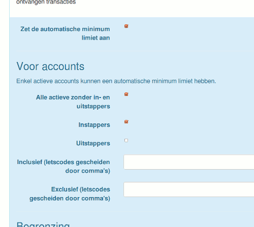
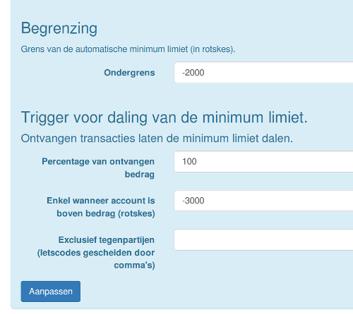

# Automatisch dalende minimum limiet

Deze functionaliteit in eLAND maakt het mogelijk om de minimum limiet op saldi van nieuwe leden geleidelijk te laten dalen.

Zo kan het vertrouwen geleidelijk groeien en beperkt men het risico dat leden letsmunt uitgeven zonder wederprestatie.

Wanneer men de automatisch dalende minimum limiet inschakelt, zal de mimimum limiet van saldi dalen bij elke ontvangen transactie.

Een voorbeeld:

_Een nieuw lid begint met een saldo nul en een minimum limiet nul. Dus het lid kan nog niets uitgeven. Wanneer het lid 20 letseenheden verdient, daalt automatisch de minimum limiet naar -20. Het lid kan nu maximaal 40 eenheden uitgeven (saldo: +20, minimum limiet: -20). Wanneer het lid nog eens 30 eenheden ontvangt, zal de minimum limiet -50 bedragen. De minimum limiet zal blijven dalen tot de absolute en algemeen geldende minimum limiet bereikt is._

Het formulier 'Automatische minimum limiet' bevat nogal wat opties, een standaard instelling volstaat gewoonlijk:

De ondergrens is de algemeen geldende minimum limiet in je groep. De minimum limieten zullen slechts dalen tot de ingestelde ondergrens.

