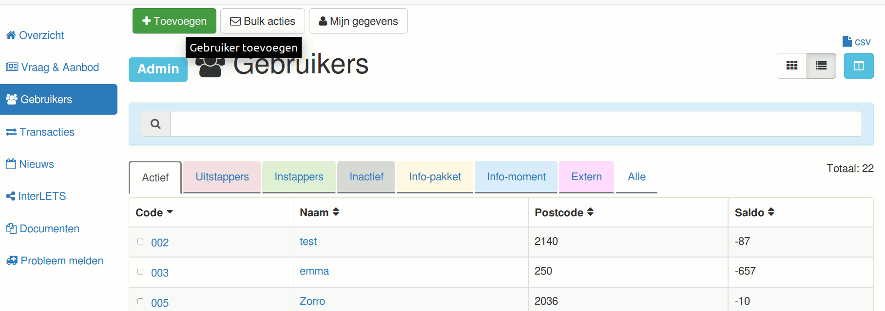
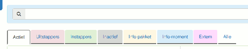
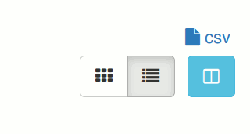
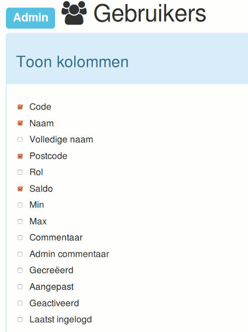
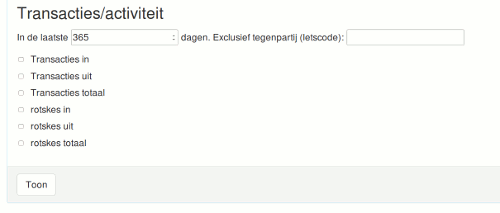
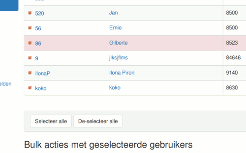
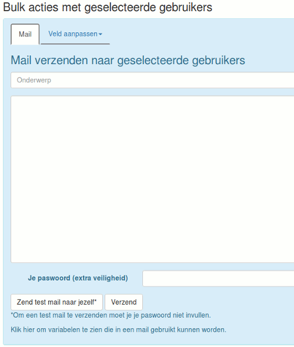
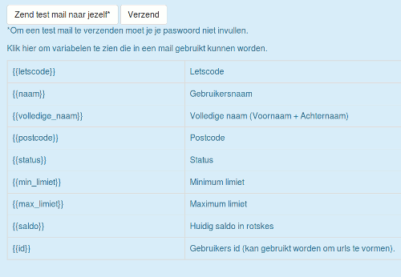
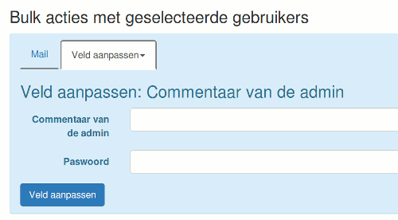

# Gebruikers beheren

Voor admins worden zijn alle gebruikers toegankelijk, zowel de actieve leden als de niet-actieve gebruikers, als de externe rekeningen (interlets rekeningen).

Met de gekleurde tabs boven de tabel kan je een groep gebruikers met een bepaalde status selecteren:

* _Actief_ : alle leden, ook de instappers en de uitstappers zijn hierbij. Al deze leden hebben toegang tot de webtoepassing.
* _Uitstappers_ : deze leden gaan de groep verlaten.
* _Instappers_ : de nieuwe leden. Het aantal dagen dat een lid als instapper getoond wordt, kan je aanpassen in de [Instellingen](./instellingen).
* _Inactief_ : status te geven aan gebruikers die lid waren maar uitgestapt zijn. Zij hebben geen login toegang meer.
* _Info-pakket_ : Status te geven aan gebruikers die net ingeschreven zijn maar nog geen info-moment gevolgd hebben. Zij hebben nog geen login toegang.
* _Info-moment_ : Status te geven aan gebruikers die een info-moment gevolgd hebben. Zij hebben nog geen login toegang.
* _Extern_ : Status te geven aan interletsrekeningen.

Rechtsboven zie je een knop om de gebruikerstabel te exporteren als csv.

## Toon kolommen

Met de blauwe knop klap je een panel open alwaar je de kolommen kan selecteren die getoond moeten worden.
Dit is handig voor de admin! Om je selectie te zien, druk op de knop 'Toon' onderaan het paneel.

Gebruiksvoorbeelden:

* _Je wil slapende leden opsporen_: onderaan vink je dan onder 'Activiteit' 'totaal' aan (de naam van je lokale munteenheid staat erbij. En je vult in: in de laatste 365 dagen. Je kan eventueel ook de letscode van je secretariaat invullen bij 'exclusief tegenpartij'. Zo worden ledenbijdragen niet meegerekend. Dan klik je op de knop 'Toon' onderaan in het paneel. Je ziet nu de extra kolom met het totaal. Dat is het totaal dat iemand ontvangen en uitgegeven heeft het afgelopen jaar. Je kan op deze kolom sorteren door op de hoofding van de kolom te klikken. Zo worden de gebruikers gesorteerd van actief naar minder actief (of omgekeerd).

* _Je wil adressen afdrukken op etiketten_: selecteer 'volledige naam' en 'adres'split door , (komma) . Dit geeft drie kolommen. Het adres wordt opgesplitst in 2 kolommen (voor en na komma). Je kan dan deze tabel exporteren als csv, door het linkje rechtsboven. Dit csv linkje exporteert steeds de tabel zoals hij is. En vervolgens kan je inladen in Excel of Open Office om alzo de adressen te printen.

## Bulk acties

Je kan naar meerdere gebruikers in één keer een gepersonaliseerde mail versturen. En je kan van meerdere gebruikers in één keer de waarde van een veld veranderen.

### De selectie

In de eerste kolom staat er een aanvinkvakje waarmee je elke gebruiker kan selecteren. Je kan ook alle gebruikers in de tabel selecteren door onder de tabel op de knop 'Selecteer alle' te klikken.

### Bulk actie #1: Gepersonaliseerde mail

Helemaal onderaan vindt je een formulier om gepersonaliseerde bulk mail te versturen naar de geselecteerde gebruikers.

Om de mail te versturen moet je je eigen paswoord invullen ter extra beveiliging.
Je kan eerst een mail naar jezelf sturen om te testen.
De variabelen die je kan invullen, kan je zien door onderaan het formulier te klikken. Een paneel met informatie klapt open.

Bvb. je kan de leden persoonlijk aanspreken door in de mail te schrijven: Beste {{naam}},

### Bulk actie #2: Veld aanpassen van meerdere gebruikers

