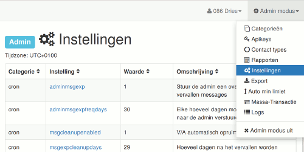

# Instellingen

## adminmsgexp

   'Stuur de admin een overzichtmail met vervallen messages'
   __Dit zijn vraag en aanbod berichten die vervallen zijn.__
   Mogelijke waarden: 0, 1 (0 = nee, 1 = ja)

## adminmsgexpfreqdays

   'Elke hoeveel dagen moet de overzichtsmail naar de admin verstuurd worden'
   __Dit is de overzichtsmail met vervallen vraag en aanbod.__
   Vul een geheel getal in

## msgcleanupenabled

   'V/A automatisch opruimen'
   Mogelijke waarden: 0, 1 (0 = nee, 1 = ja) aanbevole waarde: 1

## msgexpcleanupdays

   'Hoeveel dagen na het vervallen worden messages verwijderd'
   __Dit zijn de vraag en aanbod berichten__
   Vul een geheel getal in

## msgexpwarnenabled

   'Mails versturen bij verval van messages'
   __Op de dag dat een vraag of aanbod vervalt, wordt een mail met vraag tot verlengen naar de gebruiker gestuurd__
   Mogelijke waarden: 0, 1 (0 = nee, 1 = ja)

## saldofreqdays

   'Saldo-mails worden om dit aantal dagen verstuurd'
   __Dit is feitelijk een overzichts mail van alle recent geplaatst vraag en aanbod, samen met andere informatie zoals het huidige saldo. (in eLAS bevatte deze mail enkel het huidige saldo, vandaar de benaming).__
   Vul een geheel getal in. Vul 7 in voor een wekelijkse overzichtsmail met vraag en aanbod.

## admin

   'Mailadres van de site admin'
   Vul een mailadres in.

## mailenabled

   'Mail functionaliteit aanzetten'
   __Bij testen zet op 0__
   Mogelijke waarden: 0, 1 (0 = nee, 1 = ja)

## newsadmin

   'email adres van de nieuws-beheerder'
   __De nieuwsbeheerder krijgt notificaties wanneer nieuwe nieuwsberichten goed- of afgekeurd moeten worden.__
   Vul een mailadres in.

## support

   'Mailadres van de support persoon of groep'
   __Mails van het helpformulier worden naar dit adres gestuurd.__
   Vul een mailadres in.

## currency

   'LETS-eenheid voor de groep'
   Vul de naam van je Letseenheid in.

## currencyratio

   'letseenheden per uur'
   __De waarde van de LETSeenheid uitgedrukt in tijd__
   Vul een geheel getal in.

## maintenance

   'Onderhoudsmodus (alleen admins kunnen inloggen)'
   Mogelijke waarden: 0, 1 (0 = alle leden kunnen inloggen, 1 = enkel admins kunnen inloggen)

## newuserdays

   'Aantal dagen dat een gebruiker als instapper getoond wordt'
   Vul een geheel getal in.

## systemname

   'Systeemnaam'
   __De naam van de groep.__

## systemtag

   'Systeemtag'
   __Een korte code voor de groep__

## maxlimit

   'Limiet voor maxstand voor nieuwe gebruikers'
   Vul een geheel getal in.

## minlimit

   'Limiet voor minstand voor nieuwe gebruikers'
   Vul een geheel getal in.

## users_can_edit_username

   'Gebruikers kunnen zelf hun gebruikersnaam aanpassen [0, 1]'
   Mogelijke waarden: 0, 1 (0 = nee, 1 = ja)

## users_can_edit_fullname

   'Gebruikers kunnen zelf hun volledige naam (voornaam + achternaam) aanpassen [0, 1]'
   Mogelijke waarden: 0, 1 (0 = nee, 1 = ja)

## registration_en

   'Inschrijvingsformulier ingeschakeld [0, 1]'
   Mogelijke waarden: 0, 1 (0 = nee, 1 = ja)

## forum_en

   'Forum ingeschakeld [0, 1]'
   Mogelijke waarden: 0, 1 (0 = nee, 1 = ja)

## css

   'Extra stijl: url van .css bestand'
   __Vul eventueel hier een url van een css bestand in om stijlkenmerken te overschrijven. Bvb. om een logo of een (lichte) achtergrond kleur toe te voegen. Wanneer niet gebruikt, vul 0 (nul) in.__

## msgs_days_default

   'Standaard geldigheidsduur in aantal dagen van vraag en aanbod.'
   __Deze standaard geldigheidsduur in dagen wordt vooraf ingevuld in het formulier van nieuw vraag of aanbod.__
   Vul een geheel getal in.

## balance_equilibrium

   'Het uitstapsaldo voor actieve leden. Het saldo van leden met status uitstapper kan enkel bewegen in de richting van deze instelling.'
   Vul een geheel getal in.