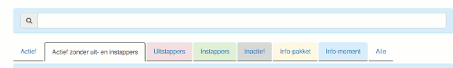
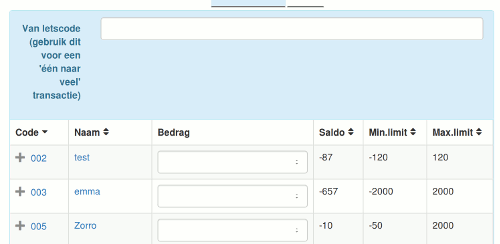

##Massa transactie

Er zijn twee soorten massa transacties met dit formulier mogelijk:

* Veel naar één. bvb. te gebruiken
  * voor ledenbijdragen.
  * om positieve saldi van gedesactiveerde accounts over te brengen naar de secretariaatsrekening.

* Eén naar veel: bvb. te gebruiken
  * om negatieve saldi van gedesactiveerde accounts terug op nul te brengen.
  * wanneer veel mensen meegewerkt hebben aan een groot project. Bvb. een bijeenkomst.

