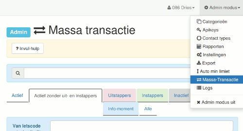
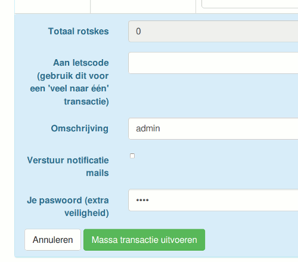
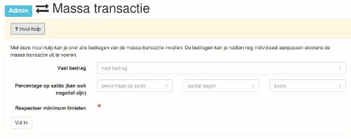

# Massa transactie

Er zijn twee soorten massa transacties met dit formulier mogelijk:

## Eén naar veel

### Transactie van één gebruiker naar meerdere gebruikers

bvb. te gebruiken

* om negatieve saldi van gedesactiveerde accounts terug op nul te brengen.
* wanneer veel mensen meegewerkt hebben aan een groot project. Bvb. een bijeenkomst.

Om een **één naar veel** transactie uit te voeren, vul eerst het veld 'Van LETScode' in. Dit vind je boven de tabel met alle gebruikers.

Bij een **één naar veel** transactie laat je het veld 'Aan LETScode' onder de tabel leeg!

## Veel naar één

### Transactie van meerdere gebruikers naar één gebruiker

bvb. te gebruiken

* voor ledenbijdragen.
* om positieve saldi van gedesactiveerde accounts over te brengen naar de secretariaatsrekening.

Om een **veel naar één** transactie uit te voeren, vul eerst het veld 'Aan letscode' in. Dit vind je onder de tabel met alle gebruikers.

Bij een **veel naar één** transactie laat je het veld 'Van letscode' boven de tabel leeg!

## Bedragen invullen

Vervolgens kan je per gebruiker het bedrag invullen dat overgeschreven zal worden.

Onder de de tabel zal je het totaal zien van de bedragen.

## Invulhulp

Bovenaan de pagina vind je de **invulhulp**. Hiermee kan je snel bedragen invullen voor alle getoonde gebruikers.

Je kan:

* Een vast bedrag invullen voor iedereen.
* Een percentage op het saldo invullen.
  * Wanneer het aantal dagen ingevuld is, wordt het percentage berekend over het gewogen gemiddelde van de voorbije periode.
  * Het percentage kan ook berekent worden ten opzichte van een andere basis dan nul. Bvb. vul je een basis in van 200, dan wordt het percentage enkel berekent op het gedeelte van een saldo boven de 200.
  * Negatieve percentages kunnen ook gebruikt worden. Dit kan nuttig zijn om een negatieve interest toe te passen bij de ledenbijdrage.

Een vast bedrag en een percentage op het saldo kan ecombineerd worden.

Natuurlijk kunnen steeds de bedragen individueel nog gereviseerd en aangepast worden alvorens de massa-transactie uit te voeren.
