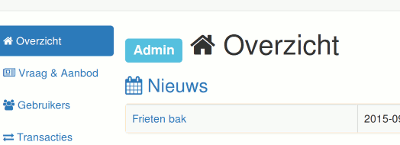
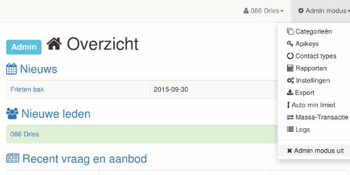
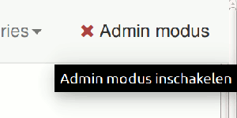

# Admin rechten

Wanneer je inlogt en je ziet naast de hoofding het label 'admin', dan heb je admin rechten.

Als admin heb je in de rechterbovenhoek ook een neerklapbaar navigatie menu met links naar pagina's die alleen toegankelijk zijn voor de admin.

Met de menu link  'Admin modus uit' kan je overschakelen op gewone gebruikersmodus, zie je hetzelfde als gewone gebruikers zien en zijn de geavanceerde admin functies uitgeschakeld.

Om de admin functies weer aan te schakelen klik je op de link rechtsboven in het navigatiemenu.

